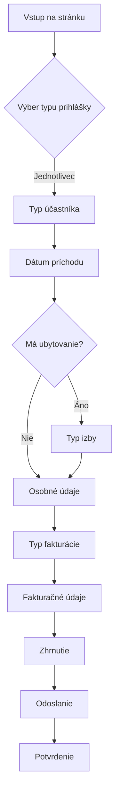
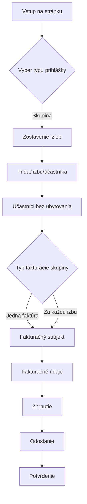
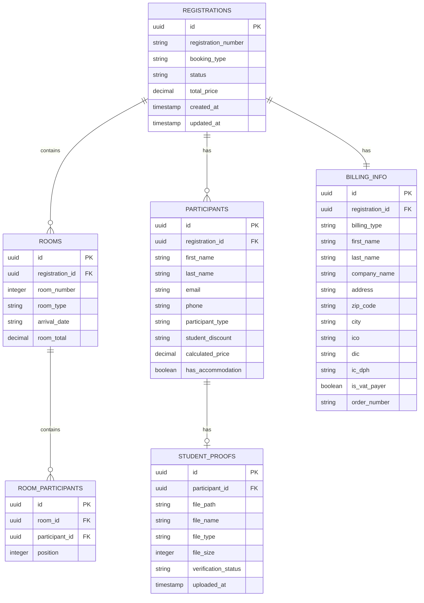

# Kongres OÚS 2025 - Registračný systém
## Kompletná technická dokumentácia

---

## 📋 Obsah

1. [Prehľad projektu](#prehľad-projektu)
2. [Technologický stack](#technologický-stack)
3. [Štruktúra projektu](#štruktúra-projektu)
4. [Frontend architektúra](#frontend-architektúra)
5. [Dátové modely](#dátové-modely)
6. [Cenová kalkulácia](#cenová-kalkulácia)
7. [User Flow (tok používateľa)](#user-flow)
8. [Backend špecifikácia](#backend-špecifikácia-návrh)
9. [Databázový návrh](#databázový-návrh)
10. [API Endpointy](#api-endpointy)
11. [Bezpečnosť](#bezpečnosť)
12. [Budúce rozšírenia](#budúce-rozšírenia)

---

## 🎯 Prehľad projektu

### Účel
Registračný systém pre 19. odborný kongres očných optikov a optometristov Slovenska (OÚS).

### Základné informácie o podujatí
- **Názov:** Kongres OÚS 2025
- **Dátum:** 10.–12. októbra 2025
- **Miesto:** Ski & Wellness Residence Družba, Demänovská Dolina

### Hlavné funkcie
- ✅ Individuálna registrácia účastníkov
- ✅ Skupinová registrácia (viacero izieb)
- ✅ Dynamický výpočet ceny
- ✅ Podpora študentských zliav
- ✅ Členské zľavy OÚS
- ✅ Rôzne typy ubytovania
- ✅ Fakturačné údaje (fyzické osoby, firmy, inštitúcie)

---

## 🛠 Technologický stack

### Frontend
| Technológia | Verzia | Účel |
|-------------|--------|------|
| React | 18.3.1 | UI framework |
| TypeScript | - | Typová bezpečnosť |
| Vite | - | Build nástroj |
| Tailwind CSS | - | Styling |
| shadcn/ui | - | Komponentová knižnica |
| React Router | 6.30.1 | Routing |
| React Query | 5.83.0 | State management |
| Lucide React | 0.462.0 | Ikony |
| Zod | 3.25.76 | Validácia schém |
| React Hook Form | 7.61.1 | Formuláre |

### Plánovaný Backend
| Technológia | Účel |
|-------------|------|
| Supabase (Lovable Cloud) | BaaS platforma |
| PostgreSQL | Databáza |
| Supabase Auth | Autentifikácia admin panelu |
| Supabase Edge Functions | Serverless funkcie |
| Supabase Storage | Ukladanie súborov (študentské doklady) |

---

## 📁 Štruktúra projektu

```
src/
├── components/
│   ├── ui/                          # shadcn/ui komponenty
│   │   ├── button.tsx
│   │   ├── card.tsx
│   │   ├── checkbox.tsx
│   │   ├── input.tsx
│   │   ├── label.tsx
│   │   ├── select.tsx
│   │   └── ...
│   │
│   ├── Step0BookingType.tsx         # Výber typu prihlášky
│   ├── Step1ParticipantType.tsx     # Typ účastníka (člen/nečlen)
│   ├── Step2ArrivalDate.tsx         # Dátum príchodu
│   ├── Step3Accommodation.tsx       # Typ ubytovania
│   ├── Step4Details.tsx             # Osobné údaje
│   ├── Step4CBillingType.tsx        # Typ fakturácie
│   ├── Step4DBillingDetails.tsx     # Fakturačné údaje
│   ├── Step5Summary.tsx             # Zhrnutie a potvrdenie
│   │
│   ├── StepGroupBooking.tsx         # Skupinová prihláška - izby
│   ├── StepGroupBilling.tsx         # Skupinová fakturácia
│   ├── RoomCard.tsx                 # Karta izby
│   ├── ParticipantWithoutAccommodationCard.tsx  # Účastník bez ubytovania
│   ├── SelectArrivalDate.tsx        # Výber dátumu (reusable)
│   │
│   ├── ProgressBar.tsx              # Progress indikátor
│   ├── NavLink.tsx                  # Navigačný link
│   └── SuccessScreen.tsx            # Obrazovka úspešnej registrácie
│
├── pages/
│   ├── Index.tsx                    # Hlavná stránka s wizard logikou
│   └── NotFound.tsx                 # 404 stránka
│
├── hooks/
│   ├── use-mobile.tsx               # Hook pre mobile detection
│   └── use-toast.ts                 # Toast notifikácie
│
├── lib/
│   └── utils.ts                     # Utility funkcie
│
├── App.tsx                          # Root komponenta s routingom
├── main.tsx                         # Entry point
└── index.css                        # Globálne štýly
```

---

## 🏗 Frontend architektúra

### Hlavný komponent (Index.tsx)

#### State Management
```typescript
const [formData, setFormData] = useState({
  // Typ prihlášky
  bookingType: "",                    // "individual" | "group"
  
  // Individuálna prihláška
  participantType: "",                // Typ účastníka
  arrivalDate: "",                    // Dátum príchodu
  roomType: "",                       // Typ izby
  participants: [],                   // Zoznam účastníkov
  
  // Skupinová prihláška
  rooms: [],                          // Zoznam izieb
  participantsWithoutAccommodation: [], // Účastníci bez ubytovania
  groupBillingType: "",               // Typ skupinovej fakturácie
  
  // Fakturačné údaje
  billingType: "",                    // Typ subjektu
  billingData: {},                    // Fakturačné údaje
});
```

### Wizard kroky

#### Individuálna prihláška
| Krok | Komponent | Popis |
|------|-----------|-------|
| 0 | Step0BookingType | Výber: jednotlivec vs skupina |
| 1 | Step1ParticipantType | Typ: člen/nečlen/rodinný príslušník |
| 2 | Step2ArrivalDate | Piatok/Sobota/Bez ubytovania |
| 3 | Step3Accommodation | Typ izby (preskočené ak bez ubytovania) |
| 4 | Step4Details | Osobné údaje účastníka |
| 5 | Step4CBillingType | Typ fakturácie |
| 6 | Step4DBillingDetails | Fakturačné údaje |
| 7 | Step5Summary | Zhrnutie a odoslanie |

#### Skupinová prihláška
| Krok | Komponent | Popis |
|------|-----------|-------|
| 0 | Step0BookingType | Výber: jednotlivec vs skupina |
| 1 | StepGroupBooking | Zostavenie izieb a účastníkov |
| 2 | StepGroupBilling | Jedna faktúra vs faktúra za izbu |
| 3 | Step4CBillingType | Typ fakturácie |
| 4 | Step4DBillingDetails | Fakturačné údaje |
| 5 | Step5Summary | Zhrnutie a odoslanie |

---

## 📊 Dátové modely

### Účastník (Participant)
```typescript
interface Participant {
  firstName: string;           // Meno
  lastName: string;            // Priezvisko
  email: string;               // Email
  phone: string;               // Telefón
  participantType: string;     // Typ účasti
  studentDiscount: string;     // Študentská zľava
  studentProof?: File | null;  // Doklad o štúdiu
  totalPrice: number;          // Vypočítaná cena
}
```

### Typ účastníka (ParticipantType)
| Hodnota | Popis | Zľava |
|---------|-------|-------|
| `member` | Člen OÚS | -50€ |
| `non-member` | Nečlen OÚS | - |
| `family-member` | Rodinný príslušník člena | Špeciálne ceny |
| `family-non-member` | Rodinný príslušník nečlena | Špeciálne ceny |

### Izba (Room)
```typescript
interface Room {
  roomId: number;              // ID izby
  roomType: string;            // Typ izby
  arrivalDate: string;         // Dátum príchodu
  participants: Participant[]; // Účastníci v izbe
  roomTotal: number;           // Celková cena izby
}
```

### Typ izby (RoomType)
| Hodnota | Popis | Max. účastníkov |
|---------|-------|-----------------|
| `double-private` | 2-posteľová samostatná | 1 |
| `double-shared` | 2-posteľová zdieľaná | 2 |
| `triple-shared` | 3-posteľová zdieľaná | 3 |

### Dátum príchodu (ArrivalDate)
| Hodnota | Popis | Noci |
|---------|-------|------|
| `friday` | Piatok 10.10.2025 | 2 |
| `saturday` | Sobota 11.10.2025 | 1 |
| `saturday-no-accommodation` | Bez ubytovania | 0 |

### Fakturačné údaje (BillingData)
```typescript
interface BillingData {
  firstName?: string;      // Meno (fyzická osoba)
  lastName?: string;       // Priezvisko (fyzická osoba)
  companyName?: string;    // Názov firmy/inštitúcie
  address: string;         // Adresa
  zipCode: string;         // PSČ
  city: string;            // Mesto
  ico?: string;            // IČO
  dic?: string;            // DIČ
  icDph?: string;          // IČ DPH
  isVatPayer?: boolean;    // Platiteľ DPH
  orderNumber?: string;    // Číslo objednávky (inštitúcie)
}
```

### Typ fakturácie (BillingType)
| Hodnota | Popis |
|---------|-------|
| `individual` | Fyzická osoba |
| `freelancer` | SZČO / Živnostník |
| `company` | Firma |
| `institution` | Štátna inštitúcia |

---

## 💰 Cenová kalkulácia

### Cenník (PRICING)

#### Člen OÚS
| Ubytovanie | Piatok (2 noci) | Sobota (1 noc) |
|------------|-----------------|----------------|
| 2-posteľová zdieľaná | 380€ | 305€ |
| 2-posteľová samostatná | 525€ | 380€ |
| 3-posteľová zdieľaná | 315€ | 275€ |
| Bez ubytovania | - | 165€ |

#### Nečlen OÚS
| Ubytovanie | Piatok (2 noci) | Sobota (1 noc) |
|------------|-----------------|----------------|
| 2-posteľová zdieľaná | 420€ | 345€ |
| 2-posteľová samostatná | 580€ | 420€ |
| 3-posteľová zdieľaná | 345€ | 315€ |
| Bez ubytovania | - | 195€ |

#### Rodinný príslušník člena
| Ubytovanie | Piatok (2 noci) | Sobota (1 noc) |
|------------|-----------------|----------------|
| 2-posteľová zdieľaná | 325€ | 270€ |
| 3-posteľová zdieľaná | 280€ | 245€ |

#### Rodinný príslušník nečlena
| Ubytovanie | Piatok (2 noci) | Sobota (1 noc) |
|------------|-----------------|----------------|
| 2-posteľová zdieľaná | 360€ | 300€ |
| 3-posteľová zdieľaná | 310€ | 280€ |

### Zľavy

| Typ zľavy | Výška | Podmienka |
|-----------|-------|-----------|
| Členská zľava | -50€ | Člen OÚS |
| Študentská zľava | -50% | ISIC karta alebo potvrdenie o štúdiu |

### Algoritmus výpočtu ceny
```typescript
function calculatePrice(participant, room, arrivalDate) {
  // 1. Určiť základnú cenu podľa typu účasti a ubytovania
  let basePrice = PRICING[memberKey][dayKey][roomKey];
  
  // 2. Aplikovať študentskú zľavu (50%)
  if (hasStudentDiscount) {
    basePrice *= 0.5;
  }
  
  // 3. Aplikovať členskú zľavu (-50€)
  if (isMember) {
    basePrice -= 50;
  }
  
  return basePrice;
}
```

---

## 🔄 User Flow

### Individuálna registrácia



### Skupinová registrácia



---

## 🔧 Backend špecifikácia (návrh)

### Architektúra

```
┌─────────────────────────────────────────────────────────┐
│                    Frontend (React)                      │
├─────────────────────────────────────────────────────────┤
│                  Supabase Client SDK                     │
├─────────────────────────────────────────────────────────┤
│                                                          │
│  ┌─────────────┐  ┌─────────────┐  ┌─────────────────┐  │
│  │   Auth      │  │  Database   │  │  Edge Functions  │  │
│  │  (Admin)    │  │ (PostgreSQL)│  │   (Serverless)   │  │
│  └─────────────┘  └─────────────┘  └─────────────────┘  │
│                                                          │
│  ┌─────────────┐  ┌─────────────┐  ┌─────────────────┐  │
│  │  Storage    │  │   Realtime  │  │   RLS Policies   │  │
│  │  (Files)    │  │ (Websocket) │  │   (Security)     │  │
│  └─────────────┘  └─────────────┘  └─────────────────┘  │
│                                                          │
└─────────────────────────────────────────────────────────┘
```

### Edge Functions

| Funkcia | Účel |
|---------|------|
| `submit-registration` | Spracovanie registrácie |
| `send-confirmation-email` | Odoslanie potvrdenia |
| `generate-invoice` | Generovanie faktúry |
| `verify-student-discount` | Overenie študentskej zľavy |
| `export-registrations` | Export do CSV/Excel |

---

## 🗃 Databázový návrh

### ER Diagram



### SQL Schema

```sql
-- Registrácie
CREATE TABLE registrations (
    id UUID PRIMARY KEY DEFAULT gen_random_uuid(),
    registration_number VARCHAR(20) UNIQUE NOT NULL,
    booking_type VARCHAR(20) NOT NULL CHECK (booking_type IN ('individual', 'group')),
    status VARCHAR(20) DEFAULT 'pending' CHECK (status IN ('pending', 'confirmed', 'paid', 'cancelled')),
    group_billing_type VARCHAR(20) CHECK (group_billing_type IN ('single', 'per_room')),
    total_price DECIMAL(10, 2) NOT NULL,
    created_at TIMESTAMP WITH TIME ZONE DEFAULT NOW(),
    updated_at TIMESTAMP WITH TIME ZONE DEFAULT NOW()
);

-- Izby
CREATE TABLE rooms (
    id UUID PRIMARY KEY DEFAULT gen_random_uuid(),
    registration_id UUID REFERENCES registrations(id) ON DELETE CASCADE,
    room_number INTEGER NOT NULL,
    room_type VARCHAR(20) NOT NULL CHECK (room_type IN ('double-private', 'double-shared', 'triple-shared')),
    arrival_date VARCHAR(30) NOT NULL CHECK (arrival_date IN ('friday', 'saturday', 'saturday-no-accommodation')),
    room_total DECIMAL(10, 2) NOT NULL,
    created_at TIMESTAMP WITH TIME ZONE DEFAULT NOW()
);

-- Účastníci
CREATE TABLE participants (
    id UUID PRIMARY KEY DEFAULT gen_random_uuid(),
    registration_id UUID REFERENCES registrations(id) ON DELETE CASCADE,
    first_name VARCHAR(100) NOT NULL,
    last_name VARCHAR(100) NOT NULL,
    email VARCHAR(255) NOT NULL,
    phone VARCHAR(30),
    participant_type VARCHAR(30) NOT NULL CHECK (participant_type IN ('member', 'non-member', 'family-member', 'family-non-member')),
    student_discount VARCHAR(20) DEFAULT 'none' CHECK (student_discount IN ('none', 'student-isic', 'student-proof')),
    calculated_price DECIMAL(10, 2) NOT NULL,
    has_accommodation BOOLEAN DEFAULT true,
    created_at TIMESTAMP WITH TIME ZONE DEFAULT NOW()
);

-- Prepojenie izba-účastník
CREATE TABLE room_participants (
    id UUID PRIMARY KEY DEFAULT gen_random_uuid(),
    room_id UUID REFERENCES rooms(id) ON DELETE CASCADE,
    participant_id UUID REFERENCES participants(id) ON DELETE CASCADE,
    position INTEGER NOT NULL,
    UNIQUE (room_id, participant_id)
);

-- Fakturačné údaje
CREATE TABLE billing_info (
    id UUID PRIMARY KEY DEFAULT gen_random_uuid(),
    registration_id UUID UNIQUE REFERENCES registrations(id) ON DELETE CASCADE,
    billing_type VARCHAR(20) NOT NULL CHECK (billing_type IN ('individual', 'freelancer', 'company', 'institution')),
    first_name VARCHAR(100),
    last_name VARCHAR(100),
    company_name VARCHAR(200),
    address VARCHAR(255) NOT NULL,
    zip_code VARCHAR(10) NOT NULL,
    city VARCHAR(100) NOT NULL,
    ico VARCHAR(20),
    dic VARCHAR(20),
    ic_dph VARCHAR(20),
    is_vat_payer BOOLEAN DEFAULT false,
    order_number VARCHAR(50),
    created_at TIMESTAMP WITH TIME ZONE DEFAULT NOW()
);

-- Študentské doklady
CREATE TABLE student_proofs (
    id UUID PRIMARY KEY DEFAULT gen_random_uuid(),
    participant_id UUID REFERENCES participants(id) ON DELETE CASCADE,
    file_path VARCHAR(500) NOT NULL,
    file_name VARCHAR(255) NOT NULL,
    file_type VARCHAR(50) NOT NULL,
    file_size INTEGER NOT NULL,
    verification_status VARCHAR(20) DEFAULT 'pending' CHECK (verification_status IN ('pending', 'verified', 'rejected')),
    uploaded_at TIMESTAMP WITH TIME ZONE DEFAULT NOW(),
    verified_at TIMESTAMP WITH TIME ZONE,
    verified_by UUID
);

-- Indexy pre optimalizáciu
CREATE INDEX idx_registrations_status ON registrations(status);
CREATE INDEX idx_registrations_created_at ON registrations(created_at);
CREATE INDEX idx_participants_email ON participants(email);
CREATE INDEX idx_rooms_registration_id ON rooms(registration_id);
CREATE INDEX idx_participants_registration_id ON participants(registration_id);

-- Trigger pre aktualizáciu updated_at
CREATE OR REPLACE FUNCTION update_updated_at()
RETURNS TRIGGER AS $$
BEGIN
    NEW.updated_at = NOW();
    RETURN NEW;
END;
$$ LANGUAGE plpgsql;

CREATE TRIGGER update_registrations_updated_at
    BEFORE UPDATE ON registrations
    FOR EACH ROW
    EXECUTE FUNCTION update_updated_at();
```

### RLS Policies (Row Level Security)

```sql
-- Verejný prístup na vkladanie (registrácia)
ALTER TABLE registrations ENABLE ROW LEVEL SECURITY;

CREATE POLICY "Allow public insert" ON registrations
    FOR INSERT TO anon
    WITH CHECK (true);

-- Admin prístup na čítanie
CREATE POLICY "Admin read access" ON registrations
    FOR SELECT TO authenticated
    USING (auth.jwt() ->> 'role' = 'admin');

-- Admin prístup na update
CREATE POLICY "Admin update access" ON registrations
    FOR UPDATE TO authenticated
    USING (auth.jwt() ->> 'role' = 'admin')
    WITH CHECK (auth.jwt() ->> 'role' = 'admin');
```

---

## 🌐 API Endpointy

### REST API (Edge Functions)

| Metóda | Endpoint | Popis |
|--------|----------|-------|
| POST | `/functions/v1/submit-registration` | Odoslanie registrácie |
| GET | `/functions/v1/registration/:id` | Získanie detailu registrácie |
| POST | `/functions/v1/send-confirmation` | Odoslanie potvrdzovacieho emailu |
| POST | `/functions/v1/generate-invoice` | Generovanie proforma faktúry |
| POST | `/functions/v1/verify-student` | Overenie študentského dokladu |
| GET | `/functions/v1/export` | Export registrácií (admin) |

### Príklad: Submit Registration

**Request:**
```json
POST /functions/v1/submit-registration
Content-Type: application/json

{
  "bookingType": "individual",
  "participants": [
    {
      "firstName": "Ján",
      "lastName": "Novák",
      "email": "jan.novak@email.sk",
      "phone": "+421901234567",
      "participantType": "member",
      "studentDiscount": "none"
    }
  ],
  "arrivalDate": "friday",
  "roomType": "double-shared",
  "billingType": "individual",
  "billingData": {
    "firstName": "Ján",
    "lastName": "Novák",
    "address": "Hlavná 123",
    "zipCode": "81101",
    "city": "Bratislava"
  }
}
```

**Response:**
```json
{
  "success": true,
  "registrationId": "550e8400-e29b-41d4-a716-446655440000",
  "registrationNumber": "OUS-2025-00123",
  "totalPrice": 330.00,
  "message": "Registrácia úspešne uložená"
}
```

---

## 🔒 Bezpečnosť

### Frontend
- ✅ Validácia vstupov (Zod schemas)
- ✅ Sanitizácia dát
- ✅ HTTPS only
- ✅ Content Security Policy

### Backend (plánované)
- 🔲 Row Level Security (RLS)
- 🔲 Rate limiting
- 🔲 Input validation
- 🔲 SQL injection prevention
- 🔲 XSS protection
- 🔲 CORS configuration

### Súbory
- ✅ Validácia typu súboru (JPG, PNG, PDF)
- ✅ Limit veľkosti (5MB)
- 🔲 Virus scanning (plánované)
- 🔲 Secure storage paths

---

## 🚀 Budúce rozšírenia

### Fáza 1 - Backend implementácia
- [ ] Integrácia Supabase / Lovable Cloud
- [ ] Databázová schéma
- [ ] API endpointy
- [ ] Email notifikácie

### Fáza 2 - Admin panel
- [ ] Autentifikácia administrátorov
- [ ] Dashboard so štatistikami
- [ ] Správa registrácií
- [ ] Export dát (CSV, Excel, PDF)
- [ ] Overovanie študentských zliav

### Fáza 3 - Platby
- [ ] Integrácia Stripe
- [ ] Automatické faktúry
- [ ] Platobné notifikácie
- [ ] Storno poplatky

### Fáza 4 - Rozšírenia
- [ ] QR kód pre vstup
- [ ] Mobilná appka pre check-in
- [ ] Program kongresu
- [ ] Networking funkcie
- [ ] Hodnotenie prednášok

---

## 📞 Kontakt

Pre technické otázky kontaktujte vývojový tým.

---

*Dokumentácia vytvorená: Január 2025*
*Verzia: 1.0.0*
